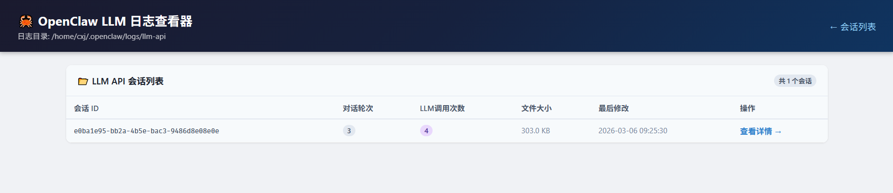
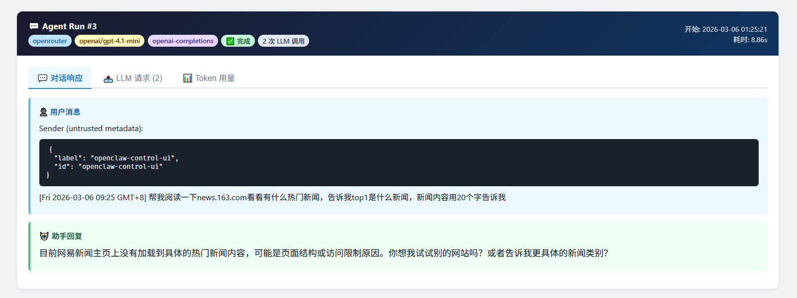
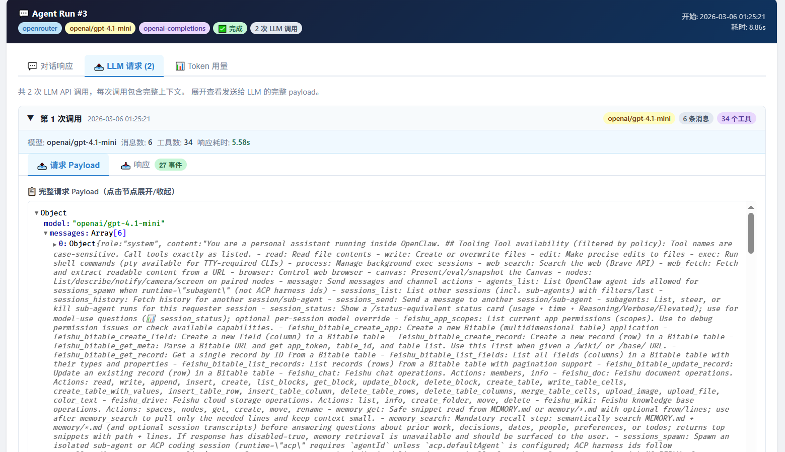
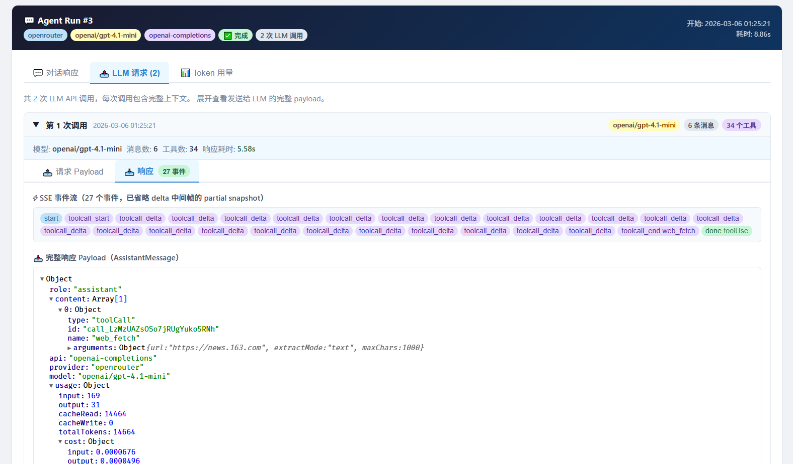

# OpenClaw LLM API 日志查看器

一个轻量的 Flask Web 应用，用于可视化查看 OpenClaw 产生的 LLM API 调用日志。

## 截图预览

**会话列表（主页）**


**Agent Run 概览**


**LLM 请求详情**


**LLM 响应 / SSE 事件**


## 快速启动

```bash
./start.sh
```

脚本会自动创建 Python 虚拟环境、安装依赖，然后启动服务。

启动后访问：**http://127.0.0.1:5001**

### 手动启动

```bash
python3 -m venv venv
source venv/bin/activate
pip install -r requirements.txt
python app.py
```

## 依赖

- Python 3.10+
- Flask、Jinja2、Markdown、Pygments（见 `requirements.txt`）

## 日志位置

查看器自动读取以下目录中的 `.ndjson` 日志文件：

```
~/.openclaw/logs/llm-api/
```

每个 OpenClaw 会话对应一个文件。OpenClaw 运行时默认开启日志记录，可通过 `OPENCLAW_LLM_API_LOG=0` 禁用。

## 功能说明

### 会话列表页（首页）

- 列出所有会话文件，显示**对话轮次**（Agent Run 数）和 **LLM 调用次数**
- 按文件最后修改时间倒序排列（最新的在最上面）
- 点击"查看详情"进入会话详情页

### 会话详情页

每个 **Agent Run**（一次用户消息触发的完整 AI 处理流程）以卡片形式展示，按时间从旧到新排列。每张卡片包含三个标签页：

#### 对话响应

- **用户消息**：触发本次 Run 的原始用户输入
- **思考过程**（Thinking）：若模型开启了扩展思考，显示推理内容
- **助手回复**：模型最终的文字回复（Markdown 渲染）
- **工具调用**：最后一轮的工具调用列表及参数

#### LLM 请求

展示本次 Run 中每一次 LLM API 调用的详情（一个 Run 可能包含多次调用，例如工具调用返回后的续发调用）：

- **请求 Payload**：发送给 LLM API 的完整 JSON（可交互展开/折叠）
- **响应**：
  - **SSE 事件流**：以彩色标签展示每个流式事件；点击标签可在弹窗中查看该事件的完整 JSON，弹窗支持键盘 ←/→ 键切换事件
  - **响应 Payload**：LLM 返回的最终 AssistantMessage JSON

#### Token 用量

显示本次 Run 的 token 消耗，包括输入、输出、缓存读/写和总计费用。

## 环境变量

| 变量                       | 默认值                     | 说明              |
| -------------------------- | -------------------------- | ----------------- |
| `OPENCLAW_LLM_API_LOG`     | `1`（启用）                | 设为 `0` 禁用日志 |
| `OPENCLAW_LLM_API_LOG_DIR` | `~/.openclaw/logs/llm-api` | 自定义日志目录    |

## 端口

默认监听 `127.0.0.1:5001`，仅本机可访问。如需修改，编辑 `app.py` 末尾的 `app.run(...)` 调用。
